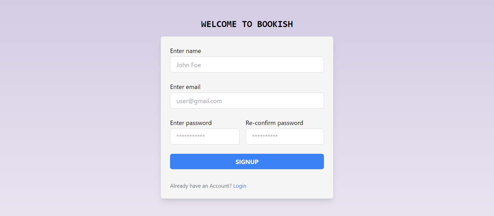
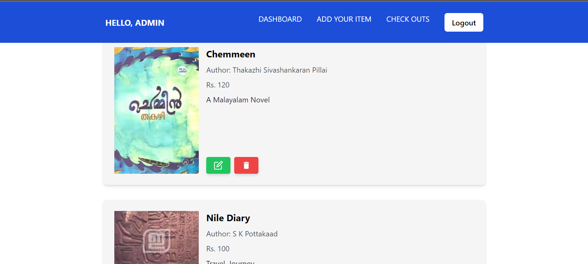
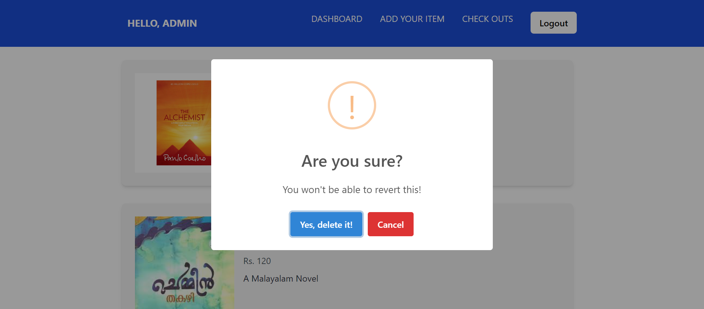
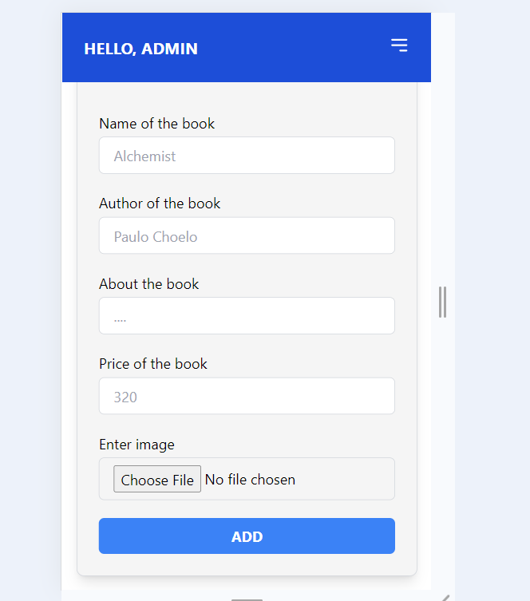

# BOOKISH 
**An Online bookstore application specially for Book-worm buddies.**
**A Full stack Web Application developed using MERN**

## Links

- **Task Explanation** : [Loom Video](https://www.loom.com/share/d0b2fd8cdfc347fcb25295d3e0f0be5c?sid=803f54fb-e7da-4500-93cf-86e95f6a04f2)

- **API Documentation**: [Postman](https://documenter.getpostman.com/view/26846855/2sA3XQfMFW)

- **Live Link**: [live Link](https://bookish-eta.vercel.app/)

- **Admin Side**: [admin link](https://bookish-eta.vercel.app/login)

**To login as admin, use the following credentials as email and password respectively:**

    admin24@gmail.com
    admin@2024

## Tools Used:

    - Node js
    - Express js
    - JsonWebToken
    - Reactjs
    - Tailwind CSS
    - Redux-toolkit
    - RTK Query (Redux-toolkit Query)
    - MongoDB

## Some of the screenshots from app

---

---

---

## Follow these steps to run this on your local machine:

### Prerequisites

    - Node.js (v14.x or later)
    - npm (v6.x or later) or yarn (v1.22.x or later)
    - Git

### Clone the repository 
    - git clone https://github.com/Sharukhhh/Bookish.git

### Setting up the backend

  1. Navigate to backend diectory
    - **cd back-end**

  2. Install the dependencies
    - **npm install**
  
  3. start the backend server
    - **npm start**

### Setting up the Frontend

  1. Navigate to frontend diectory
    - **cd front-end**

  2. Install the dependencies
    - **npm install**
  
  3. start the backend server
    - **npm run dev**